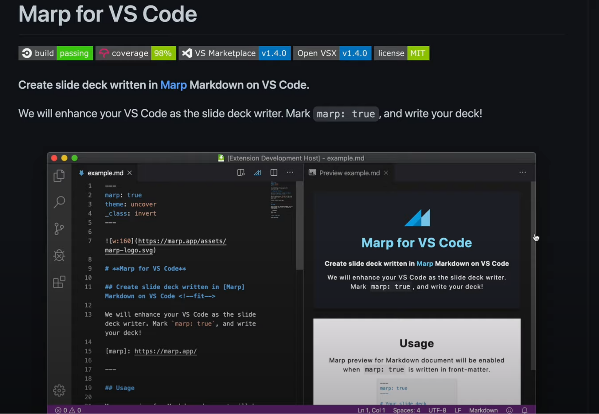

# Markdown

>**Este es el lenguaje de marcado empleado para crear este sitio, que permite formatear el texto fácilmente sin la necesidad de emplear el más engorroso HTML o emplear un editor visual.**
_________________________________________________

# Sintaxis Markdown
<!--*los comentarios van dentro de <> -->

## Tipos de encabezado o Cabeceras

# Encabezado H1
    # Encabezado H1
Párrafo encabezado H1

## Encabezado H2
    ## Encabezado H2
Párrafo encabezado H2

### Encabezado H3
    ### Encabezado H3
Párrafo encabezado H3

#### Encabezado H4
    #### Encabezado H4
Párrafo encabezado H4

##### Encabezado H5
    ##### Encabezado H5
Párrafo encabezado H5

###### Encabezado H6
    ###### Encabezado H6
Párrafo encabezado H6

> Se puede encerrar cada encabezado entre almohadillas, por motivos puramente estéticos, porque no es necesario en absoluto.

### Encabezado H3 ###
    ### Encabezado H3 ###
Párrafo encabezado H3

> Para los encabezados de los dos primeros niveles existe también otra manera de hacer lo mismo. En los encabezados H1 se subraya el texto con el signo igual. Para los encabezados H2 se utilizan guiones para subrayar.

Encabezado H1
====
    Encabezado H1
    ====

Párrafo encabezado H1

Encabezado H2
----
    Encabezado H2
    ----

Párrafo encabezado H2
_______________________________________________________________________________

## Citas {#Citas}

> Para crear bloques de cita, se emplea el carácter mayor que > antes del bloque de texto.
>
> Recuerda separar los saltos de línea con >, o >> si te encuentras dentro de la cita anidada; para crear párrafos dentro del mismo bloque de cita.

A continuación, se muestran usos de citas.

##### Ejemplo 1

Esto es una línea normal                                              

> Esto es parte de un bloque de cita.
> Esto es parte del mismo bloque de cita.

##### Ejemplo 2

> Esto es parte de un bloque de cita.
Esto continúa el bloque incluso aunque no hay símbolo 'mayor que'.

La línea en blanco finaliza el bloque.

##### Ejemplo 3

Esto es una línea normal

> Esto es parte de un bloque de cita.
> Esto es parte del mismo bloque de cita.
>
> > Esto es otro bloque de cita anidado.
> > Esto es parte del bloque anidado.
>
> Esto es parte del bloque de cita de primer nivel.

--------------------------------------------------------------------------------

## Listas

>Markdown permite crear dos tipos de listas, ordenadas y desordenadas, es decir numeradas o listas de puntos.

#### Lista de puntos (desordenada)
<!--*desordenada, se puede utilizar * o - para los items-->

* Un elemento de la lista
* Otro elemento de la lista
* El tercer elemento de la lista

Se pueden emplear también + o - en vez de *

* Un elemento de la lista
* Otro elemento de la lista
* El tercer elemento de la lista

#### Lista numerada (ordenada)
<!--*Ordenada o numéricas-->

1. Este es el primer elemento
2. Este es el segundo elemento
3. Este es el tercer elemento

#### Lista anidada
<!--*Listas anidadas-->

Se pueden mezclar distintos tipos de listas y anidar unas dentro de otras.

1. Esto es una lista ordenada
2. Segundo elemento de la lista ordenada
    1. Esta es una lista ordenada anidada dentro de otra
        * Lista desordenada anidada a tercer nivel
        * Segundo elemento de esta lista
    2. Este es el segundo elemento de la lista ordenada anidada

* Nivel 1
  1. Nivel 2
  2. Nivel 2
  3. Nivel 2
* Nivel 1
  * Nivel 2
    1. Nivel 3
    2. Nivel 3
    3. Nivel 3
       * Nivel 4
         1. Nivel 5
         2. Nivel 5
         3. Nivel 5
         * Nivel 5
           1. Nivel 6
           2. Nivel 6
           * Nivel 6
------------------------------------------------------------------------------------------

<!--*Separaciones entre secciones de texto-->
## Separaciones Horizontales
>Para crear líneas horizontales se debe crear una línea rodeada de líneas en blanco y compuesta por 3 o más símbolos, que pueden ser guiones, asteriscos o guiones bajos. Pueden crearse espacios entre estos caracteres si así se desea por estética.

    ***
***

    ---
---

    ___
___


-----------------------------------------------------------------------------------------

## Estilos de textos

>Se pueden emplear indistintamente tanto el asterisco * como el guión bajo _ siempre y cuando no se mezclen y lo que determina el formato es el número de ellos antes y después del bloque de texto a formatear. Uno es cursiva, dos es negrita, y tres ambas a la vez.

    Texto en **negrita**
    Texto en __negrita__
Texto en **negrita**
Texto en __negrita__

    Texto en _cursiva_
    Texto en *cursiva*
Texto en _cursiva_
Texto en *cursiva*

    Texto ~~tachado~~
Texto ~~tachado~~

    Texto en **_cursiva y negrita_**
    Texto en ___cursiva y negrita___
Texto en **_cursiva y negrita_**
Texto en ___cursiva y negrita___

    Texto ~~_tachado y cursiva_~~
Texto ~~_tachado y cursiva_~~

    Texto ~~**tachado y negrita**~~
Texto ~~**tachado y negrita**~~

    Texto ~~**_tachado, cursiva y negrita_**~~
Texto ~~**_tachado, cursiva y negrita_**~~

    Texto <u>subrayado</u>
Texto <u>subrayado</u>


------------------------------------------------------------------------------------------
## Párrafos
>Para crear párrafos se deja una línea en blanco.

Este es el primer párrafo.

Este es el segundo párrafo.

>Para crear un salto de línea dentro de un párrafo, simplemente se dejan dos espacios al final de la última palabra de esa línea.

Esta es la primera línea  
y este es el salto de línea.

------------------------------------------------------------------------------------------

## Enlaces

#### Enlaces en texto (url)

##### Con título
     [Con titulo](http://joedicastro.com "titulo")
[Ejemplo de enlace Con titulo](http://joedicastro.com "titulo")
[pi-hole](https://geekland.eu/instalar-configurar-pi-hole-raspberry-pi/ "Explicación de como instalar Pi-hole") es una opción interesante. <!--Para agregar un título en reemplazo de la url pero aún con la ulr enlazada-->

##### Sin título
     [Sin titulo](http://joedicastro.com)
[Ejemplo de enlace Sin titulo](http://joedicastro.com)
[pi-hole](https://geekland.eu/instalar-configurar-pi-hole-raspberry-pi/) es una opción interesante.<!--Para incluir en algún texto una url-->

##### Varios enlaces
     [Enlace 1][1], [Enlace 2][2], [Enlace 3][3]

     [1]: http://joedicastro.com/consejos
     [2]: http://joedicastro.com/consejos "Consejos"
     [3]: http://joedicastro.com/
[Enlace 1][1], [Enlace 2][2], [Enlace 3][3]

 [1]: http://joedicastro.com/consejos
 [2]: http://joedicastro.com/consejos "Consejos"
 [3]: http://joedicastro.com/


##### Sin texto adicional
     <http://joedicastro.com>
<http://joedicastro.com>
<https://geekland.eu/instalar-servidor-dlna-readymedia-raspberry-pi-linux/> <!--Para agregar una ulr sin texto adicional-->

-------------------------------------------------------------------------------------------------------------------------

## Imágenes
>La manera de enlazar imágenes es básicamente la misma de crear enlaces, con un única diferencia, se añade el carácter exclamación ! al principio de la pareja de corchetes que definen el nombre del enlace.

##### Con enlace web 

     
 <!--Imagen agregada por ulr-->

##### Con enlace y título

     
 <!--Se carga por url, además se agrega un título a la imagen-->

##### Locales
    [Con titulo](pictures/avatar.png "titulo")
    
    

 <!--Imagen agregada localmente-->

#### Varias imágenes locales    

    ![Imagen 1][1]  ![Imagen 2][2]

    [1]: pictures/avatar.png
    [2]: pictures/scaphandre.png "scaphandre"


-----------------------------------------------------------------------------------------------------------

## Insertar enlaces o imágenes Segundo Método

##### Enlaces: Método 2

>En un texto cada vez que aparezca una palabra que se quiera enlazar se pone entre corchetes

    [Geekland] es un blog que acostumbra a publicar tutoriales. [Geekland] también da soporte a los usuarios que lo piden.
    
    [geekland]: https://geekland.eu

[Geekland] es un blog que acostumbra a publicar tutoriales. [Geekland] también da soporte a los usuarios que lo piden.

[geekland]: https://geekland.eu

> Al final de documento se definen los enlaces con la ulr correspondientes, entonces cada palabra Geekland entre corchetes generará un enlace


##### Imágenes: Método 2

> En un texto cada vez que aparezca una palabra que se quiera enlazar a una imagen se pone entre corchetes

    [Vscode] es un blog que acostumbra a publicar tutoriales. [Vscode] también da soporte a los usuarios que lo piden.

    [vscode]: (https://user-images.githubusercontent.com/674621/71187801-14e60a80-2280-11ea-94c9-e56576f76baf.png)


[Vscode] es un blog que acostumbra a publicar tutoriales. [Vscode] también da soporte a los usuarios que lo piden.

[vscode]: (https://user-images.githubusercontent.com/674621/71187801-14e60a80-2280-11ea-94c9-e56576f76baf.png)


---------------------------------------------------------------------------------------------------------------------------
## Código
>Antes de código se escriben 3 ''' después del código, ''' + tipo lenguaje para activar el resaltado de sintaxis.

    ```html
       <!DOCTYPE html>
       <html>
        <head>
          <title>Ejemplo</title>
     </head>
     <body>
       <?php
        echo "¡Hola, mundo PHP!";
      ?>
      </body>
    </html>
    ```

```html
<!DOCTYPE html>
<html>
  <head>
    <title>Ejemplo</title>
  </head>
  <body>
    <?php
     echo "¡Hola, mundo PHP!";
    ?>
  </body>
</html>
```

```python
import lifetime
    
for each_day in lifetime.days():
        carpe_diem() 
```


```latex
\documentclass[12pt]{article}
\usepackage{lingmacros}
\usepackage{tree-dvips}
\begin{document}

\section*{Notes for My Paper}
```
> También se puede agregar 2 tabulaciones al inicio del texto. 

Esto es un párrafo normal.  

    Esto es un párrafo de código.

>Existe otro modo de crear un bloque de código, encerrándolo entre dos líneas formadas por tres o más caracteres tilde ~

Esto es un párrafo normal

      ~~~
      Esto es un párrafo de código.
      ~~~

~~~
Esto es un párrafo de código.
~~~

~~~
python
import lifetime
    
for each_day in lifetime.days():
        carpe_diem() 
~~~


>Por último existe una opción para resaltar pequeños trozos de código dentro de párrafos de texto normal. Para lograr esto debemos encerrar el código entre dos acentos graves `

    Esto es un párrafo normal, con un trozo de código, `import this` insertado en el medio del mismo.

Esto es un párrafo normal, con un trozo de código, `import this` insertado en el medio del mismo.

El comando para instalar LibreOffice es `sudo apt install libreoffice`. <!--Lo que se quiere resaltar de escribe dentro 'código a resaltar'-->

----------------------------------------------------------------------------------------------------------------------

## Tareas
> Para una lista de tareas o checklist solo se debe * [] ,si no esta echa queda en blanco, en caso contrario *[x]

``` 
* [x] llevar los niños a natación
* [ ] aprender markdown
* [ ] renovar mi suscripción del gimnasio  
```

* [x] llevar los niños a natación
* [ ] aprender markdown
* [ ] renovar mi suscripción del gimnasio


----------------------------------------------------------------------------------------------------------------
## Tablas

> Para crear tablas se debe indicar los elementos de cabecera y separar los campor con el simbolo |

    Cabecera A | Cabecera B
    -- | --
    Campo A0 | Campo B0
    Campo A1 | Campo B1

Cabecera A | Cabecera B
-- | --
Campo A0 | Campo B0
Campo A1 | Campo B1

> Por estética se pueden alinear columnas, comenzar y finalizar las filas con |

    | Cabecera A | Cabecera B |
    | ---------- | ---------- |
    | Campo A0   | Campo B0   |
    | Campo A1   | Campo B1   |

| Cabecera A | Cabecera B |
| ---------- | ---------- |
| Campo A0   | Campo B0   |
| Campo A1   | Campo B1   |

>Se puede especificar la alineación de cada columna mediante la adición de dos puntos a las líneas de separación. Dos puntos a la izquierda de la línea de separación hará que la columna esté alineada a la izquierda, dos puntos a la derecha de la línea hará que la columna esté alineada a la derecha, dos puntos en ambos lados significa que la columna se alinea al centro.

    | Elemento | Cantidad | Precio |
    | :------- | :------: | -----: |
    | Item 1   | 15       | 150€   |
    | Item 2   | 3250     | 23,65€ |

| Elemento | Cantidad | Precio |
| :------- | :------: | -----: |
| Item 1   | 15       | 150€   |
| Item 2   | 3250     | 23,65€ |

------------------------------------------------------------------------------------------------------------------

## Notas al pie de página
>Cada nota de pie de página se compone de dos elementos: un marcador al lado del texto que se convierte en un superíndice y de una definición que se puede colocar en una lista de notas al pie al final de documento.

Este año visitaremos la Giralda [^1]. Será una visita importante.
Es importante ir este año.

[^1]: Nombre que recibe la torre campanario de la catedral de Santa Maria de la Sede.

>Para agregar un pie de página, se agrega [^palabra-sin-espacio] después de la palabra que se le quiere añadir el pie,a continuación se escribe [^palabra-sin-espacio]: Definición de la palabra a la que se quiere hacer mención al pie de página.

    Esto es un texto con nota al pie [^2]

    [^2]: Esto es una nota al pie de página.

Esto es un texto con nota al pie [^2]

[^2]: Esto es una nota al pie de página.

>Las definiciones de la nota al pie se pueden encontrar en cualquier parte del documento, pero las notas siempre se mostrarán en el orden en que están vinculados en el texto. Hay que tener en cuenta que no puede hacer dos enlaces a la misma nota al pie: si se intenta, la referencia de la nota segunda quedará como texto sin formato.

>Cada marcador de nota debe tener un nombre distinto. Ese nombre se utiliza para vincular la nota a la que hace referencia a las definiciones de la nota, pero no tiene ningún efecto sobre la numeración de las notas al pie. Los nombres pueden contener cualquier carácter válido que sirva para la una Identificación de un atributo HTML.

    Esto es un texto con nota al pie [^nota1] y esta es otra nota [^nota2]

    [^nota1]: Esto es una tercera nota al pie de página.
    [^nota2]: Esto es la cuarta nota al pie.

Esto es un texto con nota al pie [^nota1] y esta es otra nota [^nota2]

[^nota1]: Esto es una tercera nota al pie de página.
[^nota2]: Esto es la cuarta nota al pie.

------------------------------------------------------------------------------------------------------------------

## Abreviaciones

>Para crear abreviaturas HTML lo único necesario es crear una lista de ellas (normalmente al final del texto) y en cualquier lugar del texto que aparezca la abreviatura se aplicará automáticamente. Las listas de abreviaturas se crean como las listas de enlaces, pero precedidas por un asterisco.

El TAS aprobó su solicitud.

\*[TAS]: Tribunal de arbitraje del deporte.

A partir de estos momentos siempre que escribamos TAS tendremos su definición disponible.

>Se escribe la abreviación en el párrafo, después se escribe la *[abreviación]: Definición de la abreviación. Al pasar el cursor por la abreviación se mostrará la definición.

    La especificación HTML es mantenida por el W3C.

    *[HTML]: Hyper Text Markup Language
     *[W3C]:  World Wide Web Consortium

La especificación HTML es mantenida por el W3C.

*[HTML]: Hyper Text Markup Language
 *[W3C]:  World Wide Web Consortium

------------------------------------------------------------------------------------------------------------------
## Listas de Definiciones

<!--*Se escribe la palabra a definir, después Enter: Definición. Si son más de una se repite Enter: Definición-->

#### Una definición por termino

    Primer termino
    : Primera definición

    Segundo termino
    : Segunda definición

Primer termino
 : Primera definición

Segundo termino
 : Segunda definición

> Si dejamos una línea en blanco entre el termino y la definición, se creara un párrafo para la definición.

    Primer termino

    : Primera definición

    Segundo termino
    : Segunda definición

Primer termino

: Primera definición

Segundo termino
 : Segunda definición

#### Más de una definición a un termino

>Se pueden aplicar más de una definición a un termino

    Primer termino
     : Primera definición
     : Segunda definición

    Segundo termino
     : Segunda definición

Primer termino
 : Primera definición
 : Segunda definición

Segundo termino
 : Segunda definición

##### Ejemplo
Markdown
: Es un lenguaje de marcado ligero creado por John Gruber.
: Es una palabra inglesa que significa reducción de precio.

> Una definición puede constar de varios párrafos.

    Primer termino
     : Primera definición

    Segundo párrafo de la primera definición

    Segundo termino
    : Segunda definición

Primer termino
 : Primera definición

Segundo párrafo de la primera definición

Segundo termino
 : Segunda definición

#### Más de un termino a una definición


    Primer termino
    Segundo termino
    : Primera definición

    Tercer termino
    : Segunda definición

Primer termino
Segundo termino
 : Primera definición

Tercer termino
 : Segunda definición

-------------------------------------------------------------------------------------------------

## Anular Código

> Se utiliza \ para anular la interpretación de Markdown de ciertos elementos.
#### Código activo

_Texto en cursiva_    

\\ \` \* \_  \{\} \[\] \(\) \# \+ \- \. \! \: \|

#### Código anulado

\*Texto en cursiva* <!--Texto sin cursiva mostrando *Teclado\*-->

    \*Texto en cursiva*

     \\ \` \* \_  \{\} \[\] \(\) \# \+ \- \. \! \: \|
> Al escribir \ se muestra lo escrito sin interpretación.

> Otra forma para mostrar lo escrito sin interpretación es agregando dos tabulaciones antes de lo que se quiere mostrar

----------------------------------------------------------------------------------------

## Insertar vídeos

>Sintaxis para insertar vídeos sin soporte en editor

    [](url_del_vídeo_que_queremos_insertar)

#### Vídeo con imagen local

    [](https://www.youtube.com/watch?v=TObd8hnPa8w)
[](https://www.youtube.com/watch?v=TObd8hnPa8w)

#### Vídeo con imagen desde web

    [](https://www.youtube.com/watch?v=HiXLkL42tMU&t=0s)
[](https://www.youtube.com/watch?v=HiXLkL42tMU&t=0s)


>Cuando la imagen para el vídeo es png se escala al tamaño de la página, si es jpg solo se muestra en la resolución de la imagen descargada.

-------------------------------------------------------------------------------------------
## Identificadores de Cabecera
>Los identificadores de cabecera nos permiten establecer un Identificador a las cabeceras para luego poder enlazarlas en cualquier otro lugar del texto. Es lo que empleo para crear el índice de esta página. Funcionaría como un anchor HTML (ancla) pero que solo se puede aplicar en las cabeceras.

    ### Esto es una cabecera con un Id {#cabecera1}

    [Enlace a esa cabecera](#cabecera1)

### Esto es una cabecera con un Id {#cabecera1}

[Enlace a esa cabecera](#cabecera1)


-------------------------------------------------------------------------------------------

## Referencias Cruzadas
>Las referencias cruzadas sirven para añadir links a partes específicas de tu documento.

>Para especificar qué un link de referencia, deberás incluir entre llaves el nombre que quieres que tenga dicho enlace de la siguiente manera {#EnlaceReferencia}.

    #### Encabezado que quieres referenciar {#EncabezadoReferencia}

>Una vez definido, puedes enlazarlo desde cualquier palabra o texto fácilmente, pero en lugar de una URL, tendrás que escribir el #NombreDeTuReferencia.

    Quiero que [este enlace](#Citas) vaya al encabezado de Citas.
Quiero que [este enlace](#Citas) vaya al encabezado de Citas.

------------------------------------------------------------------------------------------------------

## Lista Despegable
~~~
<details>
<summary>How do I dropdown?</summary>
<br>
This is how you dropdown.
</details>
~~~

<details>
<summary>How do I dropdown?</summary>
<br>
  This is how you dropdown.
</details>

<!------------------------------------------------------------------------------------------------------------->
#### Sección Despegable que contiene Markdown
~~~
<details>
  <summary>Contiene Markdown!</summary>
  
  **Heading**
  1. A numbered
  2. list
     * With some
     * Sub bullets
</details>
~~~

<details>
  <summary><b>Contiene Markdown!</b></summary>
  
  **Heading**
  ____________________________________
  1. A numbered
  2. list
     * With some
     * Sub bullets
</details>

<!------------------------------------------------------------------------------------------------------------->

#### Sección Despegable que contiene Código


```
<details>
  <summary><b>Contiene Código!</b></summary>
  
  ```javascript
    function logSometing(something) {
      console.log(`Logging: ${something}`);
    }
  ```
</details>

<details>
  <summary><b>Contiene Código!</b></summary>
  
  ```javascript
    function logSometing(something) {
      console.log(`Logging: ${something}`);
    }
  ```

</details>

<!------------------------------------------------------------------------------------------------------------->

#### Toggle multi-nivel

~~~
<details>
  <summary><b><u>Top Level Toggle</u></b></summary>

  <p>
          Great, Top Layer summary text working fine.
  </p>

  *   <details>
      <summary><b>Mid Toggle</b></summary>

      <p>
          Great, Middle Layer summary text working fine.
      </p>

      * <details>
        <summary><b><i>Inner Toggle 1</i></b></summary>

        <p>
          Great, Inner Layer summary text working fine.
        </p>

      </details>

      * <details>
        <summary><b><i>Inner Toggle 2 - should not show up when Mid Toggle is collapsed :(</i></b></summary>

        <p>
          Great, Inner Layer summary text working fine.
        </p>

      </details>
  </details>
  </details>
~~~
<details>
  <summary><b><u>Top Level Toggle</u></b></summary>

  <p>
          Great, Top Layer summary text working fine.
  </p>

  *   <details>
      <summary><b>Mid Toggle</b></summary>

      <p>
          Great, Middle Layer summary text working fine.
      </p>

      * <details>
        <summary><b><i>Inner Toggle 1</i></b></summary>

        <p>
          Great, Inner Layer summary text working fine.
        </p>

      </details>

      * <details>
        <summary><b><i>Inner Toggle 2 - should not show up when Mid Toggle is collapsed :(</i></b></summary>

        <p>
          Great, Inner Layer summary text working fine.
        </p>

      </details>
  </details>
  </details>


#### How to structure
~~~
<details>
  <summary>Click to expand!</summary>
  
 **Heading**
  1. A numbered
  2. list
     * With some
     * Sub bullets
</details>
~~~

**Two important rules:**
* Make sure you have an **empty line** after the closing `</summary>` tag, otherwise the markdown/code blocks won't show correctly.
* Make sure you have an **empty line** after the closing `</details>` tag if you have multiple collapsible sections.

#### A dash is fabulous it can create
* a bullet
* a single dash below text can interact with Markdown to render an H1
* three in a row makes a line break, a great way to create visual space or separate content in a window.
* I feel like these can be overdone, for me they often serve a visual purpose but I try to avoid using them if it makes the page look busier
a handful makes an H2 (-------------)

* and if you visually double down on them like so : (======) you will also get an H1

* You can also use them to manipulate the formatting within a table in written in markdown
  
-----------------------------------------------------------------------------------------------------------------------


## Tabla de Contenido
> Para crear una tabla de contenido, se utiliza ctrl+shift+p, después se selecciona Markdown All in One: Create Table of Contents.
 
- [Markdown](#markdown)
- [Sintaxis Markdown](#sintaxis-markdown)
  - [Tipos de encabezado o Cabeceras](#tipos-de-encabezado-o-cabeceras)
- [Encabezado H1](#encabezado-h1)
  - [Encabezado H2](#encabezado-h2)
    - [Encabezado H3](#encabezado-h3)
      - [Encabezado H4](#encabezado-h4)
        - [Encabezado H5](#encabezado-h5)
          - [Encabezado H6](#encabezado-h6)
    - [Encabezado H3](#encabezado-h3-1)
- [Encabezado H1](#encabezado-h1-1)
  - [Encabezado H2](#encabezado-h2-1)
  - [Citas {#Citas}](#citas-citas)
        - [Ejemplo 1](#ejemplo-1)
        - [Ejemplo 2](#ejemplo-2)
        - [Ejemplo 3](#ejemplo-3)
  - [Listas](#listas)
      - [Lista de puntos (desordenada)](#lista-de-puntos-desordenada)
      - [Lista numerada (ordenada)](#lista-numerada-ordenada)
      - [Lista anidada](#lista-anidada)
  - [Separaciones Horizontales](#separaciones-horizontales)
  - [Estilos de textos](#estilos-de-textos)
  - [Párrafos](#párrafos)
  - [Enlaces](#enlaces)
      - [Enlaces en texto (url)](#enlaces-en-texto-url)
        - [Con título](#con-título)
        - [Sin título](#sin-título)
        - [Varios enlaces](#varios-enlaces)
        - [Sin texto adicional](#sin-texto-adicional)
  - [Imágenes](#imágenes)
        - [Con enlace web](#con-enlace-web)
        - [Con enlace y título](#con-enlace-y-título)
        - [Locales](#locales)
      - [Varias imágenes locales](#varias-imágenes-locales)
  - [Insertar enlaces o imágenes Segundo Método](#insertar-enlaces-o-imágenes-segundo-método)
        - [Enlaces: Método 2](#enlaces-método-2)
        - [Imágenes: Método 2](#imágenes-método-2)
  - [Código](#código)
  - [Tareas](#tareas)
  - [Tablas](#tablas)
  - [Notas al pie de página](#notas-al-pie-de-página)
  - [Abreviaciones](#abreviaciones)
  - [Listas de Definiciones](#listas-de-definiciones)
      - [Una definición por termino](#una-definición-por-termino)
      - [Más de una definición a un termino](#más-de-una-definición-a-un-termino)
        - [Ejemplo](#ejemplo)
      - [Más de un termino a una definición](#más-de-un-termino-a-una-definición)
  - [Anular Código](#anular-código)
      - [Código activo](#código-activo)
      - [Código anulado](#código-anulado)
  - [Insertar vídeos](#insertar-vídeos)
      - [Vídeo con imagen local](#vídeo-con-imagen-local)
      - [Vídeo con imagen desde web](#vídeo-con-imagen-desde-web)
  - [Identificadores de Cabecera](#identificadores-de-cabecera)
    - [Esto es una cabecera con un Id {#cabecera1}](#esto-es-una-cabecera-con-un-id-cabecera1)
  - [Referencias Cruzadas](#referencias-cruzadas)
  - [Lista Despegable](#lista-despegable)
      - [Sección Despegable que contiene Markdown](#sección-despegable-que-contiene-markdown)
      - [Sección Despegable que contiene Código](#sección-despegable-que-contiene-código)
      - [Toggle multi-nivel](#toggle-multi-nivel)
      - [How to structure](#how-to-structure)
      - [A dash is fabulous it can create](#a-dash-is-fabulous-it-can-create)
  - [Tabla de Contenido](#tabla-de-contenido)


<!----------------------------------------------------------------------------------------------------------------------->

<!-- *Links de información -->

<!--*https://joedicastro.com/pages/markdown.html#mark9 -->

<!--*https://geekland.eu/aprender-markdown-en-minutos/#:~:text=Markdown%20permite%20incluir%20cajetines%20de%20c%C3%B3digo%20en%20cualquier,el%20cajet%C3%ADn.%20Presionamos%20enter%20y%20escribimos%20el%20c%C3%B3digo. -->

<!--*https://markdown.es/multimarkdown/#referencias -->


<!----------------------------------------------------------------------------------------------------------------------->